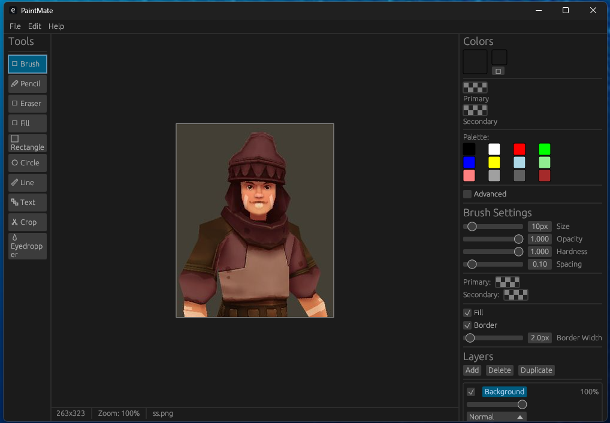

# PaintMate

A cross-platform paint application built with Rust and egui, featuring advanced image editing capabilities and a modern user interface.



## Features

### ✨ Core Features
- **Cross-platform**: Works on Windows, macOS, and Linux
- **Modern GUI**: Built with egui for responsive, immediate-mode interface
- **File Operations**: Create, open, save, and export images in multiple formats
- **Fullscreen Mode**: Clean viewing experience with customizable backgrounds

### 🎨 Drawing Tools
- **Brush**: Pressure-sensitive painting with customizable settings
- **Pencil**: Precise drawing tool
- **Eraser**: Remove parts of your artwork
- **Fill Tool**: Fill areas with color
- **Shape Tools**: Rectangle, circle, and line drawing
- **Text Tool**: Add text with font customization
- **Eyedropper**: Sample colors from your image
- **Crop Tool**: Trim your images to size

### 🎯 Brush Settings
- Adjustable brush size (1-100px)
- Opacity control (0-100%)
- Hardness adjustment
- Spacing control
- Primary and secondary colors
- Border width options

### 🖼️ Image Operations
- **Layer Support**: Work with multiple layers
- **Blend Modes**: Normal, Multiply, Screen, Overlay
- **Image Adjustments**: Brightness, contrast, hue/saturation
- **Filters**: Blur, sharpen, edge detection (coming soon)
- **Transformations**: Rotate, flip, resize, crop

### 📋 Clipboard Integration
- Copy images to system clipboard
- Paste images from clipboard
- Seamless workflow with other applications

### 🎪 Fullscreen Experience
- **Clean Viewing**: Hide UI for distraction-free viewing
- **Background Options**: Black, white, or transparent background
- **Quick Controls**: Keyboard shortcuts for common operations
- **Zoom & Pan**: Navigate large images with ease

## Installation

### Prerequisites
- Rust 1.70.0 or later
- Cargo package manager

### Building from Source
```bash
# Clone the repository
git clone https://github.com/yourusername/paintmate.git
cd paintmate

# Build the project
cargo build --release

# Run the application
cargo run --release
```

## Usage

### Getting Started
1. Launch PaintMate
2. Create a new image (Ctrl+N) or open an existing one (Ctrl+O)
3. Select a tool from the toolbar on the left
4. Adjust brush settings and colors on the right panel
5. Start creating!

### Keyboard Shortcuts
- **Ctrl+N**: New image
- **Ctrl+O**: Open image
- **Ctrl+S**: Save image
- **Ctrl+Shift+S**: Save as
- **Ctrl+Z**: Undo (coming soon)
- **Ctrl+Y**: Redo (coming soon)
- **Ctrl+C**: Copy to clipboard
- **Ctrl+V**: Paste from clipboard
- **F11**: Toggle fullscreen
- **Tab** (in fullscreen): Toggle UI visibility
- **B** (in fullscreen): Cycle background colors
- **+/-**: Zoom in/out
- **Space+Drag**: Pan image

### Fullscreen Mode
Press F11 to enter fullscreen mode for a clean viewing experience:
- Press Tab to show/hide UI controls
- Press B to cycle between black, white, and transparent backgrounds
- Use mouse wheel to zoom
- Middle-click and drag to pan

## Supported File Formats

### Import/Export
- **PNG**: Full transparency support
- **JPEG**: High-quality photos
- **GIF**: Animation support (static for now)
- **BMP**: Windows bitmap format
- **TIFF**: Professional image format

## Technical Details

### Architecture
- **Frontend**: egui (immediate mode GUI)
- **Backend**: eframe with multiple rendering backends
- **Image Processing**: image-rs library
- **File Dialogs**: rfd (Rust File Dialogs)
- **Clipboard**: clipboard-rs

### Performance
- Hardware-accelerated rendering
- Efficient memory usage with layer system
- Responsive UI even with large images
- Multi-threaded image processing

## Development

### Project Structure
```
src/
├── main.rs              # Application entry point
├── ui/                  # User interface components
│   ├── app.rs          # Main application state
│   ├── canvas.rs       # Drawing canvas
│   ├── toolbar.rs      # Tool selection
│   ├── menubar.rs      # Menu system
│   ├── color_picker.rs # Color selection
│   └── layer_panel.rs  # Layer management
├── tools/              # Drawing tools
│   ├── brush.rs        # Brush tool
│   ├── pencil.rs       # Pencil tool
│   └── ...            # Other tools
└── image_ops/          # Image operations
    ├── image_data.rs   # Core image data structure
    ├── history.rs      # Undo/redo system
    ├── adjustments.rs  # Color adjustments
    └── filters.rs      # Image filters
```

### Contributing
1. Fork the repository
2. Create a feature branch
3. Make your changes
4. Add tests if applicable
5. Submit a pull request

### Building for Different Platforms

#### Windows
```bash
cargo build --release --target x86_64-pc-windows-msvc
```

#### macOS
```bash
cargo build --release --target x86_64-apple-darwin
# or for Apple Silicon
cargo build --release --target aarch64-apple-darwin
```

#### Linux
```bash
cargo build --release --target x86_64-unknown-linux-gnu
```

## Roadmap

### Version 1.0
- [x] Basic drawing tools
- [x] Layer support
- [x] File operations
- [x] Fullscreen mode
- [ ] Undo/redo system
- [ ] Complete clipboard integration

### Version 1.1
- [ ] Advanced filters
- [ ] Animation support
- [ ] Plugin system
- [ ] Tablet pressure sensitivity
- [ ] Custom brushes

### Version 1.2
- [ ] Vector tools
- [ ] Text effects
- [ ] Batch processing
- [ ] Online collaboration

## License

This project is licensed under the MIT License - see the [LICENSE](LICENSE) file for details.

## Acknowledgments

- Built with [egui](https://github.com/emilk/egui) - An immediate mode GUI library
- Image processing powered by [image-rs](https://github.com/image-rs/image)
- File dialogs by [rfd](https://github.com/PolyMeilex/rfd)

## Support

If you encounter any issues or have feature requests, please file an issue on the GitHub repository.

---

Made with ❤️ in Rust

